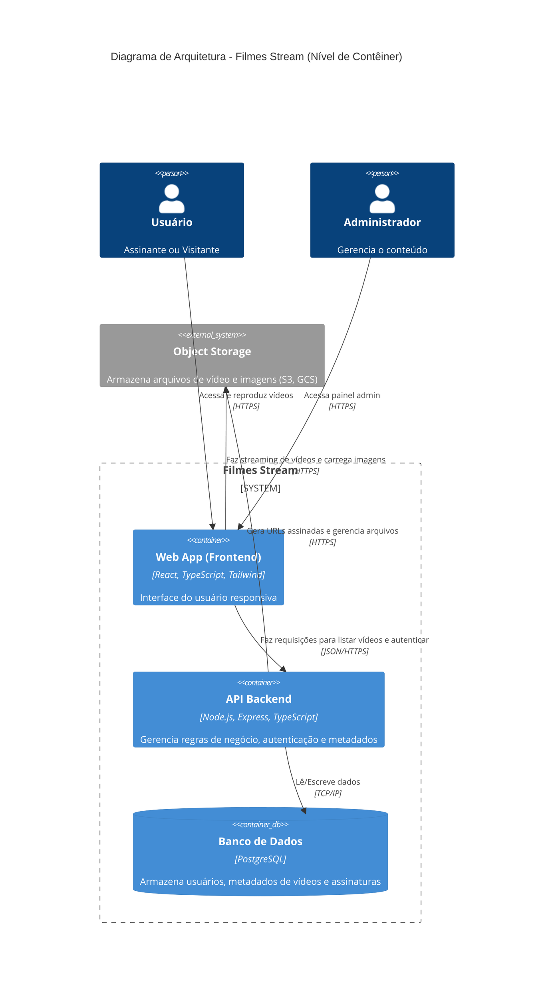

# Filmes Stream - Video Streaming MVP

## 1. Descrição do Projeto
**Filmes Stream** é uma plataforma de streaming de vídeo online (semelhante à Netflix), focada em filmes, séries, desenhos e animes. A plataforma é distribuída como um SaaS (Software as a Service) gratuito, permitindo acesso total ao conteúdo após o cadastro do usuário.

## 2. Tech Stack

- **Frontend:** React.js, TypeScript, Tailwind CSS
- **Backend (API):** Node.js, Express.js, TypeScript
- **Banco de Dados:** MySQL (utilizando mysql2)
- **Armazenamento de Vídeo:** Streaming de Vídeos Locais Integrado (Node.js FS)
- **Autenticação:** JWT (JSON Web Tokens) Customizado

## 2.1 Novas Funcionalidades Recentes

- **Suporte Completo a 16 Categorias/Gêneros e Trilhas Dinâmicas na Home:** Sistema multi-categoria onde filmes e séries podem ser associados a múltiplos gêneros no banco de dados (`Ação`, `Aventura`, `Artes Marciais`, `Policial`, `Drama`, `Comédia`, `Terror`, `Guerra`, `Faroeste`, `Ficção Científica`, `Religião`, `Documentário`, `Medieval`, `Clássicos`, `Animação`, `Suspense`). A Página Inicial gera automaticamente trilhas estilo Netflix para cada categoria com conteúdos cadastrados.
- **Suporte a Vídeos do Google Drive (Preview e Embed):** Integração automática com links do Google Drive (`/view?usp=sharing` ou `/file/d/...`), convertendo links normais em players de embed responsivos que suportam seletor de resolução (360p, 720p HD e 1080p Full HD) gerados pelo Drive.
- **Auto-Configuração de Deploy Multi-Ambiente (Vercel e Render):** Suporte nativo a build na raiz do repositório (`vercel.json` e `package.json` na raiz) garantindo deploy contínuo (CI/CD) automático via push no GitHub.
- **Servidor Interno de Streaming (Plex-like):** Permite importar vídeos de pastas locais (ex: `C:/Filmes`) e transmiti-los ao player do navegador através de HTTP Range Requests sem ferir políticas CORS.
- **Admin Video Preview:** Formulários administrativos (Conteúdo e Episódios) possuem mini-players de visualização em tempo real (suporta YouTube Iframe, Google Drive e Vídeo Nativo).
- **Hero Banners e Capas Verticais:** O sistema exibe o site usando Capas Estilo DVD/Poster para melhor compatibilidade, destacando Conteúdos sinalizados via um Banner Gigante (16:9).
- **Gaveta Inteligente de Séries:** O Player possui um menu lateral overlay (estilo Netflix) com as temporadas e episódios permitindo troca rápida de episódios da mesma série.

## 3. Diagrama de Arquitetura (Mermaid)



## 4. Modelagem de Dados (DER)

### Código dbdiagram.io
```dbml
Table Users {
  id int [pk, increment]
  name varchar
  email varchar [unique]
  password_hash varchar
  role varchar [note: "'admin' or 'user'"]
  created_at timestamp
}

Table Content {
  id int [pk, increment]
  title varchar
  description text
  thumbnail_url varchar
  video_url varchar
  content_type varchar [note: "'movie', 'series', 'cartoon', 'anime'"]
  release_year int
  created_at timestamp
}

Table Genres {
  id int [pk, increment]
  name varchar
}

Table Content_Genres {
  content_id int [ref: > Content.id]
  genre_id int [ref: > Genres.id]
  indexes {
    (content_id, genre_id) [pk]
  }
}

Table Series_Metadata {
  id int [pk, increment]
  content_id int [ref: > Content.id]
  total_seasons int
}

Table Episodes {
  id int [pk, increment]
  series_id int [ref: > Series_Metadata.id]
  season_number int
  episode_number int
  title varchar
  description text
  video_url varchar
  thumbnail_url varchar
}
```

### SQL (DDL) PostgreSQL
```sql
CREATE TABLE Users (
    id SERIAL PRIMARY KEY,
    name VARCHAR(255) NOT NULL,
    email VARCHAR(255) UNIQUE NOT NULL,
    password_hash VARCHAR(255) NOT NULL,
    role VARCHAR(50) DEFAULT 'user',
    created_at TIMESTAMP DEFAULT CURRENT_TIMESTAMP
);

CREATE TABLE Content (
    id SERIAL PRIMARY KEY,
    title VARCHAR(255) NOT NULL,
    description TEXT,
    thumbnail_url VARCHAR(255),
    video_url VARCHAR(255),
    content_type VARCHAR(50) NOT NULL,
    release_year INT,
    created_at TIMESTAMP DEFAULT CURRENT_TIMESTAMP
);

CREATE TABLE Genres (
    id SERIAL PRIMARY KEY,
    name VARCHAR(100) NOT NULL
);

CREATE TABLE Content_Genres (
    content_id INT REFERENCES Content(id) ON DELETE CASCADE,
    genre_id INT REFERENCES Genres(id) ON DELETE CASCADE,
    PRIMARY KEY (content_id, genre_id)
);

CREATE TABLE Series_Metadata (
    id SERIAL PRIMARY KEY,
    content_id INT REFERENCES Content(id) ON DELETE CASCADE,
    total_seasons INT
);

CREATE TABLE Episodes (
    id SERIAL PRIMARY KEY,
    series_id INT REFERENCES Series_Metadata(id) ON DELETE CASCADE,
    season_number INT NOT NULL,
    episode_number INT NOT NULL,
    title VARCHAR(255) NOT NULL,
    description TEXT,
    video_url VARCHAR(255),
    thumbnail_url VARCHAR(255)
);
```

## 5. Estrutura do Projeto (Boas Práticas)

### Backend (Node.js/Express)
```text
backend/
├── src/
│   ├── config/          # Configurações (banco de dados, variáveis de ambiente)
│   ├── controllers/     # Controladores das rotas (CRUD e lógica)
│   ├── middlewares/     # Middlewares (ex: autentição, validação)
│   ├── models/          # Modelos do BD (SQL queries ou ORM)
│   ├── routes/          # Definição de rotas da API
│   ├── services/        # Regras de negócio da aplicação
│   ├── utils/           # Funções utilitárias e helpers
│   ├── app.ts           # Configuração principal do Express
│   └── server.ts        # Ponto de entrada (inicia o servidor)
├── .env                 # Variáveis de ambiente
├── package.json
└── tsconfig.json
```

### Frontend (React.js)
```text
frontend/
├── src/
│   ├── assets/          # Imagens, ícones, fontes globais
│   ├── components/      # Componentes reutilizáveis (Carousel, Navbar, VideoPlayer)
│   ├── contexts/        # React Contexts (AuthContext, ThemeContext)
│   ├── hooks/           # Custom Hooks (useFetch, useAuth)
│   ├── pages/           # Componentes de página (Home, Login, AdminDashboard)
│   ├── routes/          # Configuração de roteamento
│   ├── services/        # Integração com a API (instâncias do Axios)
│   ├── styles/          # Estilos globais e Tailwind config
│   ├── App.tsx          # Componente raiz
│   └── main.tsx         # Ponto de entrada do React
├── .env                 # Variáveis de ambiente
├── package.json
├── tailwind.config.js
└── tsconfig.json
```

## 6. Snippets de Código (Backend)

### Configuração básica do servidor Express (app.ts)
```typescript
import express from 'express';
import cors from 'cors';
import contentRoutes from './routes/contentRoutes';
import authRoutes from './routes/authRoutes';

const app = express();

app.use(cors());
app.use(express.json());

// Rotas Base
app.use('/api/auth', authRoutes);
app.use('/api/content', contentRoutes);

export default app;
```

### Middleware de Autenticação JWT (authMiddleware.ts)
```typescript
import { Request, Response, NextFunction } from 'express';
import jwt from 'jsonwebtoken';

interface AuthRequest extends Request {
    user?: any;
}

export const authenticateJWT = (req: AuthRequest, res: Response, next: NextFunction) => {
    const authHeader = req.headers.authorization;

    if (authHeader) {
        const token = authHeader.split(' ')[1];

        jwt.verify(token, process.env.JWT_SECRET || 'secret', (err, user) => {
            if (err) {
                return res.status(403).json({ message: 'Token inválido.' });
            }
            req.user = user;
            next();
        });
    } else {
        res.status(401).json({ message: 'Token ausente.' });
    }
};

export const requireAdmin = (req: AuthRequest, res: Response, next: NextFunction) => {
    if (req.user && req.user.role === 'admin') {
        next();
    } else {
        res.status(403).json({ message: 'Acesso negado. Apenas administradores.' });
    }
};
```

### Controller para CRUD de Conteúdo Admin (contentController.ts)
```typescript
import { Request, Response } from 'express';
import { db } from '../config/database'; // Exemplo fictício de pool de conexão DB

export const createContent = async (req: Request, res: Response) => {
    try {
        const { title, description, thumbnail_url, video_url, content_type, release_year } = req.body;
        
        const result = await db.query(
            `INSERT INTO Content (title, description, thumbnail_url, video_url, content_type, release_year) 
             VALUES ($1, $2, $3, $4, $5, $6) RETURNING *`,
            [title, description, thumbnail_url, video_url, content_type, release_year]
        );
        
        res.status(201).json(result.rows[0]);
    } catch (error) {
        res.status(500).json({ error: 'Erro ao criar conteúdo.' });
    }
};

export const getAllContent = async (req: Request, res: Response) => {
    try {
        const result = await db.query('SELECT * FROM Content');
        res.status(200).json(result.rows);
    } catch (error) {
        res.status(500).json({ error: 'Erro ao buscar conteúdos.' });
    }
};
```

## 7. Snippets de Código (Frontend)

### Integração com a API usando Axios (api.ts)
```typescript
import axios from 'axios';

const api = axios.create({
    baseURL: import.meta.env.VITE_API_URL || 'http://localhost:5000/api',
});

// Interceptor para adicionar o token JWT em cada requisição
api.interceptors.request.use((config) => {
    const token = localStorage.getItem('token');
    if (token) {
        config.headers.Authorization = `Bearer ${token}`;
    }
    return config;
});

export default api;
```

### Componente React: Carrossel de Filmes (Home) (Carousel.tsx)
```tsx
import React, { useEffect, useState } from 'react';
import api from '../services/api';

interface Content {
    id: number;
    title: string;
    thumbnail_url: string;
}

interface CarouselProps {
    title: string;
    category: string;
}

const Carousel: React.FC<CarouselProps> = ({ title, category }) => {
    const [contents, setContents] = useState<Content[]>([]);

    useEffect(() => {
        const fetchContent = async () => {
            try {
                // Supondo uma rota na API que filtre por categoria
                const response = await api.get(`/content?category=${category}`);
                setContents(response.data);
            } catch (error) {
                console.error("Erro ao carregar conteúdo:", error);
            }
        };

        fetchContent();
    }, [category]);

    return (
        <div className="my-8">
            <h2 className="text-2xl font-bold text-white mb-4 px-4">{title}</h2>
            <div className="flex overflow-x-auto space-x-4 px-4 scrollbar-hide">
                {contents.map((item) => (
                    <div 
                        key={item.id} 
                        className="min-w-[200px] hover:scale-105 transition-transform duration-300 cursor-pointer"
                    >
                        
                        <p className="text-white mt-2 text-center text-sm font-medium">{item.title}</p>
                    </div>
                ))}
            </div>
        </div>
    );
};

export default Carousel;
```

## 8. Guia Básico da API (Principais Endpoints)

| Método | Endpoint | Descrição | Autenticação |
|--------|----------|-----------|--------------|
| `POST` | `/api/auth/register` | Cadastra um novo usuário | Pública |
| `POST` | `/api/auth/login` | Realiza login e retorna token JWT | Pública |
| `GET` | `/api/content` | Lista o conteúdo (com filtros por categoria) | Usuário Logado |
| `GET` | `/api/content/:id` | Retorna detalhes de um conteúdo/episódios | Usuário Logado |
| `POST` | `/api/content` | Cria um novo filme ou série | Apenas Admin |
| `PUT` | `/api/content/:id` | Atualiza metadados do conteúdo | Apenas Admin |
| `DELETE`| `/api/content/:id` | Remove um conteúdo da plataforma | Apenas Admin |

## 9. Instruções de Instalação e Execução

### Backend
1. Navegue para a pasta `backend`: 
   ```bash
   cd backend
   ```
2. Instale as dependências: 
   ```bash
   npm install
   ```
3. Configure o arquivo `.env` com suas credenciais de banco e a chave JWT secreta.
4. Execute em modo de desenvolvimento: 
   ```bash
   npm run dev
   ```

### Frontend
1. Navegue para a pasta `frontend`: 
   ```bash
   cd frontend
   ```
2. Instale as dependências: 
   ```bash
   npm install
   ```
3. Configure o arquivo `.env` com a URL base da API (ex: `VITE_API_URL=http://localhost:5000/api`).
4. Execute em modo de desenvolvimento: 
   ```bash
   npm run dev
   ```
